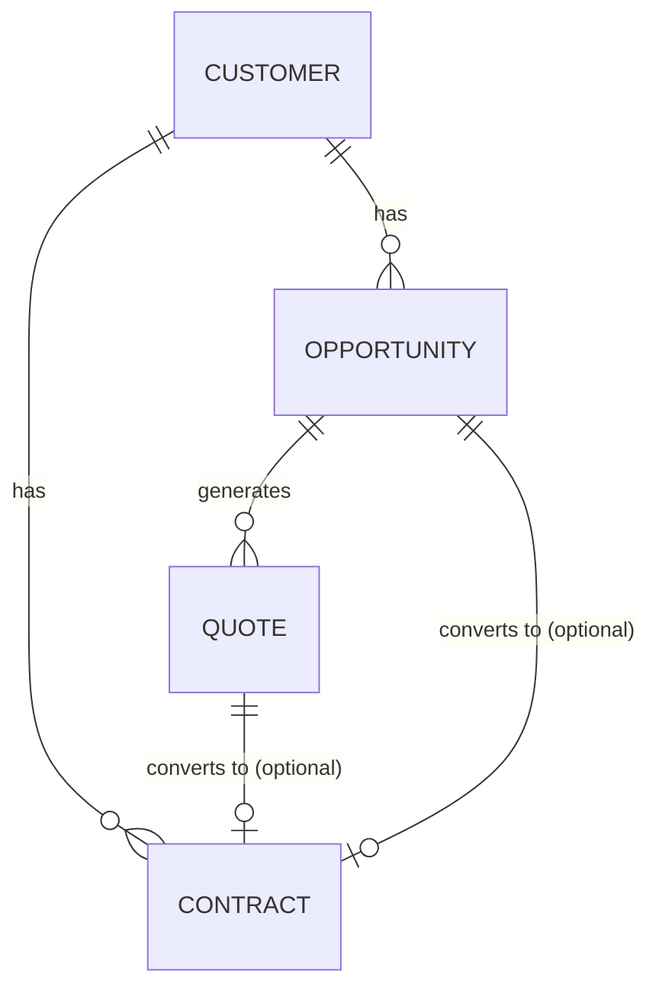

# Phase 3 Opportunity & Quote Architecture

This document defines the architectural guidelines and data models for Phase 3 of CMhelper, focusing on the introduction of the Opportunity and Quote entities, along with forward-compatibility for future Excel/CSV imports.

## 1. Entity Definitions & Relationships

- **Customer:** A person or company. The Customer is not exclusively a "prospect" or a "contracted client." A single customer can simultaneously have past/active contracts and new ongoing opportunities.
- **Opportunity:** A single sales cycle or purchasing goal (e.g., "Replacing the primary vehicle"). It is NOT defined by the number of calls, quotes, or compared vehicles.
- **Quote:** A specific set of conditions (vehicle, product type, term, capital) proposed to the customer within an Opportunity.
- **Contract:** A finalized, signed agreement. This represents the ultimate source of truth for a vehicle sale.

**Entity Relationship Diagram:**

## 2. Opportunity Lifecycle

The Opportunity represents a sales funnel. To keep the UX intuitive, we recommend a streamlined lifecycle:

1. **NEW (신규상담):** Opportunity is created, initial requirements are gathered.
2. **QUOTING (견적진행):** The salesperson is generating and comparing quotes.
3. **NEGOTIATING (조건협의):** Finalizing terms with the customer.
4. **WON (계약성공):** The customer agreed to proceed.
5. **LOST (상담종료):** The customer declined or was lost to a competitor.
6. **ON_HOLD (보류):** The customer postponed the decision.

## 3. Quote Persistence & Product Handling

### Quote Storage Policy
Quotes are NOT automatically saved on every keystroke in a calculator. Quotes are explicitly saved records representing a deliberate proposal to the customer.

### Product Types & Optional Fields
CMhelper supports diverse product types (Rent, Lease, Installment, Cash). The DB schema must accommodate varying fields without strict global NOT NULL constraints that break certain products.
- **Rent/Lease:** Requires `term_months`, `expiry_date`, `capital`, `deposit`, etc.
- **Installment:** Requires `term_months`, `interest_rate`, `capital`.
- **Cash:** Does NOT require `term_months` or `expiry_date`.
The architecture will use nullable fields or JSONB (`extra` column) to support product-specific attributes without rigid constraints.

## 4. Opportunity -> Contract Conversion

When an Opportunity is marked as **WON**, the system should NOT silently auto-generate a Contract.
**Recommended UX (Option B):** 
1. User marks Opportunity as WON.
2. A distinct action (e.g., "계약 생성" button) prompts the user to convert the selected Quote into a Contract.
3. The resulting Contract records `source_opportunity_id` and `source_quote_id` as nullable foreign keys. (Nullable because contracts can also be created manually or via direct import).

## 5. Estimate Image / File Storage

Database BLOBs for files are strictly forbidden.
- **Future Quote Storage:** Quotes will store `file_url` strings pointing to cloud storage (e.g., S3/Supabase Storage) along with metadata.
- **Legacy `Contract.estimate_image`:** Retained for backward compatibility and simple attachments. In Phase 3, this field can act as a finalized snapshot image of the contract, separate from the intermediate negotiation files stored in Quotes.

## 6. RBAC & Assignee Policy

- **Isolation:** Opportunities and Quotes adhere to the existing `company_id` tenant isolation.
- **USER Role:** Can view, edit, and create Opportunities/Quotes assigned to themselves.
- **OWNER Role:** Can view all Opportunities/Quotes within the Company and reassign them.
- **Assignee Separation:** A Customer's assignee (`assigned_user_id`) is independent of the Opportunity's assignee or the Contract's assignee. (e.g., Salesperson A registers the customer, Salesperson B handles the Opportunity).

## 7. Deprecation of `is_prospect` / `is_contracted`

Currently, `is_prospect` and `is_contracted` are used as exclusive UI toggles.
- **Issue:** A customer with an active contract can also be a prospect for a new car.
- **Action Plan:** In Phase 3, these fields will be deprecated from dictating exclusive UI tabs. The UI will shift to displaying both "Active Opportunities" and "Active Contracts" panels simultaneously on the Customer Detail page. We will migrate without altering the DB immediately, relying on the presence of related `opportunities` and `contracts` records instead of boolean flags.

## 8. Excel/CSV Import Compatibility (Future-Proofing)

While Google Sheets sync is explicitly excluded, standard Excel/CSV imports must be supported in the future.
- **Import Flow:** Upload -> Parse -> Map Columns -> Validate -> Deduplicate -> Preview -> Import.
- **Column Mapping:** The system must support mapping varying user-provided column names to CMhelper internal fields (e.g., "차종" -> `Contract.vehicle_model`).
- **Deduplication Strategy:**
  - **Primary Key for Dedup:** Customer `contact` (Phone Number).
  - **Secondary Matching:** `name` and `company_name`.
  - **Risk:** Family members sharing a phone number. The Import Preview UI must flag duplicates as "의심 (Suspected)" and allow manual override rather than auto-merging blindly.

## 9. Phase 3 Implementation Roadmap

The implementation should be phased to minimize risk and ensure stability:
- **Phase 3A (Opportunity Foundation):** DB schema for Opportunities, basic CRUD API, and Customer detail integration.
- **Phase 3B (Quote Foundation):** DB schema for Quotes, CRUD API.
- **Phase 3C (Opportunity & Quote UI):** Frontend implementation of the sales funnel and quote management.
- **Phase 3D (Conversion & Lifecycle):** Implementing the WON -> Contract conversion flow and lifecycle status updates.
- **Phase 3E (Dashboard & Analytics):** Sales funnels, conversion rates, and dashboard widgets.

## 10. Items Requiring User Decisions

Before proceeding with Phase 3A, the Chief Architect/User must confirm:
1. **Lifecycle Steps:** Does the proposed 6-step lifecycle (NEW, QUOTING, NEGOTIATING, WON, LOST, ON_HOLD) fit the exact business need, or should it be simplified?
2. **WON Conversion UX:** Confirm preference for Option B (Explicit "Create Contract" button) over silent auto-creation.
3. **Assignee Policy:** Confirm that allowing different assignees for Customer, Opportunity, and Contract is desired for the business workflow.

## 11. Phase 3A Confirmed RBAC Policies
- **OWNER Assignee Validation:** OWNERs can only assign opportunities to ACTIVE users within the SAME company.
- **USER Reassignment:** USERs are strictly forbidden from reassigning opportunities to other users.
- **Hard Delete Prevention:** Opportunities cannot be hard-deleted (returns 409). The API verifies ownership and tenant isolation before returning 409 to prevent cross-tenant existence enumeration.
- **Closed Opportunity Recovery:** Only OWNERs can recover (modify) closed (WON/LOST) opportunities. USERs cannot modify closed opportunities.

